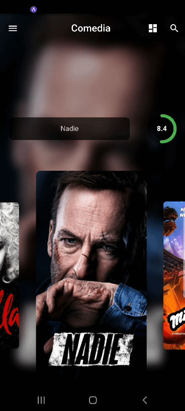
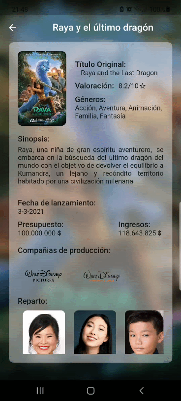
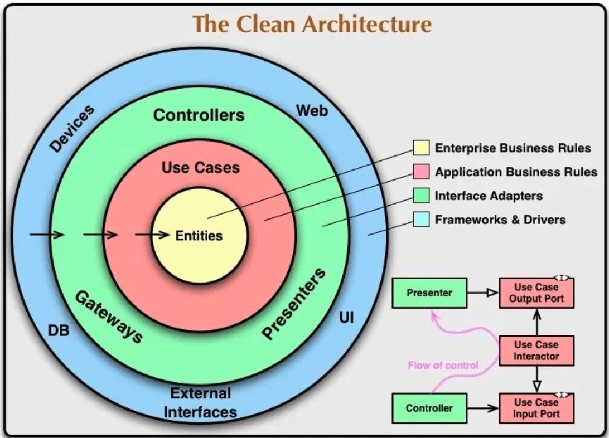
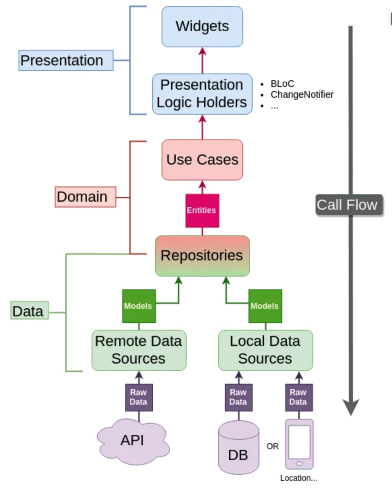

# Movies - Clean Architecture & TDD

## Introducción
Este proyecto está en desarrollo y tiene como objetivo estudiar y practicar los temas aprendidos del tutorial de 
[Resocoder: tdd-clean-architecture](https://resocoder.com/category/tutorials/flutter/tdd-clean-architecture/).

## Vista Previa
<p float="left">
  
   
  
</p>

<!--#### APK-->
<!--[Obten tu APK]()-->

## Instalación Proyecto
* [Instalar Flutter](https://flutter.dev/docs/get-started/install)
* Crear una cuenta y obtener un [API KEY aquí](https://www.themoviedb.org/documentation/api)
* Copiar el ```API KEY``` obtenido en ``./lib/core/api/movies_api.dart``
* Flutter run y listo!

## Clean Architecture
Propuesta por [El tío Bob](https://blog.cleancoder.com/uncle-bob/2012/08/13/the-clean-architecture.html).

La idea principal en la arquitectura limpia es separar el código en capas independientes, las cuales se vuelven más abstractas
cuando se avanza a las capas interiores.

<div>

<div>

La regla principal para que esta arquitectura funcione es la regla de la dependencia.

**The Dependency Rule:** Las capas exteriores pueden depender de las interiores, pero no al revés. Esto debido a que
las capas interiores deben contener las "reglas" que deben seguir las capas más exteriores, las cuales a su vez ejecutan mecanismos en
torno a estas capas interiores.

<div>

<div>

Para la implementación de esta arquitectura se utilizará la [implementación propuesta por Resocoder](https://resocoder.com/2019/08/27/flutter-tdd-clean-architecture-course-1-explanation-project-structure/),
la cual detalla en su blog.

## TDD
Test Driven Development es un proceso de desarrollo iterativo, en el cual el desarrollador escribe una prueba antes de escribir el código
suficiente para cumplirla y luego refactoriza si es necesrio.

Las ventajas de este proceso es que el desarrollador se centra más en los requisitos del sistema, preguntandose el por qué necesita la fracción de código que está
a punto de escribir antes de continuar con la implementación. 

Mediante este proceso el desarrollador puede identificar requisitos mal definidos y mejorar
sus hábitos con el tiempo, lo que conduciría a una mejora en su calidad de  código.

<div>


## Agradecimientos:
- [Resocoder](https://resocoder.com/): Tiene un excelente contenido, realmente recomiendo visitar su blog.
