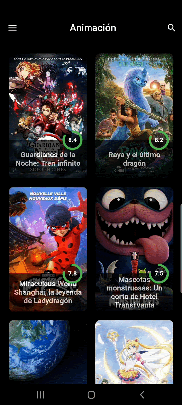

# Flutter - Clean Architecture & TDD

[](https://www.linkedin.com/in/jf96/) 

<a href="https://flutter.dev/">
  
</a>
<a href="https://flutter.dev/">
  
</a>

<a name="intro"></a>
## Introducción
Este proyecto consta de una aplicación móvil desarrollada en [Flutter](https://flutter.dev/), la cual muestra información acerca de películas 
haciendo consultas a la API de [themoviedb.org](https://www.themoviedb.org/).  


## Tabla De Contenidos
1. [Introducción](#intro)
2. [Objetivos](#obj)
2. [Vista Previa](#preview)
    * [APK](#apk)
3. [Instalación Proyecto](#install)
4. [Estructura Del Proyecto](#structure)
5. [Arquitectura Limpia (Clean Architecture)](#clean_architecture)
6. [Flujo De Trabajo (Workflow)](#workflow)
    * [Capa De Presentación](#presentation)
    * [Capa De Dominio](#domain)
    * [Capa De Datos](#data)
7. [TDD](#tdd)
8. [Testeo Unitario En Flutter (Unit Testing)](#tests)


<a name="obj"></a>
## Objetivos
* Se tiene como objetivo practicar, compartir y discutir los temas aprendidos en el blog de 
[Resocoder](https://resocoder.com/category/tutorials/flutter/tdd-clean-architecture/).
* Consumir toda la API de [themoviedb.org](https://www.themoviedb.org/).  


<a name="preview"></a>
## Vista Previa
<p float="left">
  
   
  
</p>

<a name="apk"></a>
#### APK (pendiente)
[Obten tu APK]()


<a name="install"></a>
## Instalación Proyecto
* [Instalar Flutter](https://flutter.dev/docs/get-started/install)
* Crear una cuenta y obtener un [API KEY aquí](https://www.themoviedb.org/documentation/api)
* Copiar el ```API KEY``` obtenido en ```./lib/core/api/movies_api.dart```
* Flutter run


<a name="structure"></a>
## Estructura Del Proyecto

```
├─ core/                       NÚCLEO  
│  ├─ api/                     definición de elementos asociados a la API
│  ├─ errors/                  definición de errores y excepciones
│  ├─ network/                 utils asociados a la conexión de internet
│  ├─ usecases/                definición de los casos de uso
│  └─ routes.dart              rutas de nuestro proyecto
│  
├─ data/                       CAPA DE DATOS
│  ├─ datasources/             origen de los datos solicitados por el repositorio
│  ├─ models/                  contienen funciones fromJson & toJson y heredan de una entidad
│  └─ repositories             implementación de los repositorios
│  
├─ domain/                     CAPA DE DOMINIO
│  ├─ entities/                entidades
│  ├─ repositories/            definición de los repositorios 
│  └─ usecases/                implementación de los casos de uso
│  
├─ presentation/               CAPA DE PRESENTACIÓN
│  ├─ business_logic/          gestor de estados
│  ├─ views/                   vistas
│  └─ widgets/                 widgets personalizados utilizados en las vistas
│  
├─ injection_container.dart    inyección de dependencias
└─ main.dart 

```
<a name="clean_architecture"></a>
## Arquitectura Limpia (Clean Architecture)
Propuesta por [Robert C. Martin](https://blog.cleancoder.com/uncle-bob/2012/08/13/the-clean-architecture.html).

La idea principal en la arquitectura limpia es separar el código en capas independientes, las cuales se vuelven más abstractas
cuando se avanza a las capas interiores.

Porque las capas interiores representan reglas que restringen a las capas exteriores, lo que vendría siendo **la regla
dependencia** (Las capas exteriores pueden depender de las interiores, pero no al revés).

<div>
  
<div>

La idea sería tener los requerimientos definidos, además de las entidades y casos de uso que contendrá nuestro proyecto. Teniendo estas 
reglas claras, se pueden escribir aquellos mecanismos que son necesarios para que el caso de uso sea bien ejecutado.

<a name="workflow"></a>
## Flujo De Trabajo (Workflow)
El usuario interactúa con las **vistas** gatillando **eventos**, los que al ser escuchados por nuestro **gestor de estados**,
genera un nuevo **flujo de estados**; éstos las pueden mutar para indicar en que etapa del proceso está y así permite desarrollar un **caso de uso**.

<div>
  
<div>

<a name="presentation"></a>
#### Capa de Presentación
Los widgets componen nuestras vistas y necesitan una gestión
de estados para mutar según se requiera durante la vida de la aplicación.

<div>
  
<div>

En esta ocasión se utilizó [flutter_bloc](https://pub.dev/packages/flutter_bloc).

<a name="domain"></a>
#### Capa de dominio
Como se ve en la imagen, el repositorio pertenece tanto a la capa de datos como a la de dominio,
con la gran diferencia que, en la capa de dominio sólo están las definiciones abstractas de éste
y en la capa de datos estaría la implementación.

Así se dependerá de un "contrato" definido en la capa de dominio, que deberá ser cumplido en la capa de
datos.

<div>
  
<div>


<a name="data"></a>
#### Capa de datos
Consta de una implementación de los repositorios y fuentes de datos: remoto (API) y local (CACHE).

En el repositorio se decide si devolver datos desde la api o aquellos almacenados en cache y 
cuando almacenarlos.

<div>
  
<div>

En esta capa no se trabaja con entidades, se trabaja con modelos, éstos heredan de una entidad y tienen métodos toJson y fromJson,
se obtiene el beneficio, por si en algún futuro se decide cambiar de json a xml, sin tener demasiados quebraderos de cabeza.


<a name="tdd"></a>
## TDD
<a href="https://flutter.dev/">
  
</a>
<div>

**Test Driven Development:** es un proceso de desarrollo iterativo, donde el desarrollador escribe una prueba antes de escribir el código
suficiente para cumplirla y luego refactoriza si es necesario.

Las ventajas de este proceso es que el desarrollador se centra m√°s en los requisitos del software, preguntándose el por qué necesita la fracción de código 
que está punto de escribir, antes de continuar con la implementación. 

Mediante este proceso el desarrollador puede identificar requisitos mal definidos y mejorar
sus hábitos con el tiempo, lo que conducir√≠a a una mejora en su calidad de  código.


<a name="tests"></a>
## Testeo Unitario En Flutter (Unit Testing)[pendiente]
